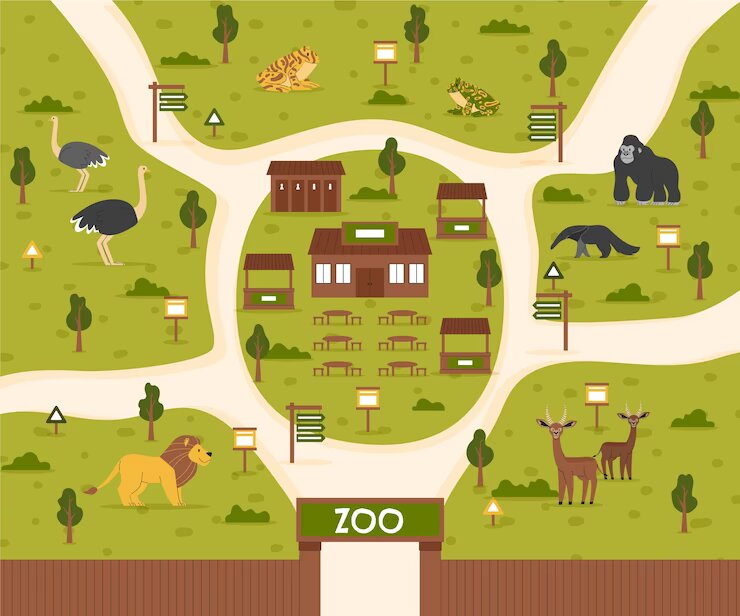

<h1>Proyecto para la materia de computación gráfica. </h1> 
<h2>Zoológico virtual </h2>  
<h2>Equipo 7:</h2>  

▶️ Garcia Camargo Jose Daniel       316086158  
▶️ Guzmán Ramírez Aldo Yael	   	    419049915 
▶️ Vázquez Flores José Martín       316243386 
<h3> Semestre 2023-2 | Grupo: 3</h3>

    </img>

